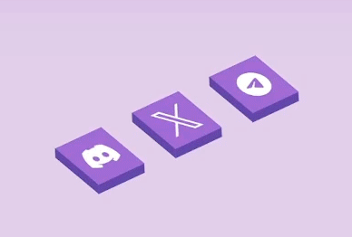
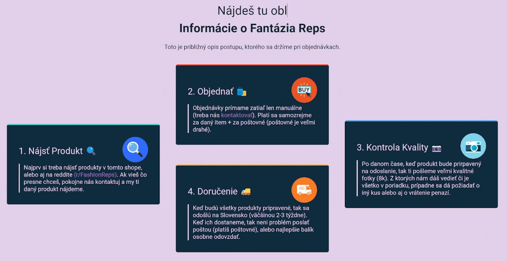
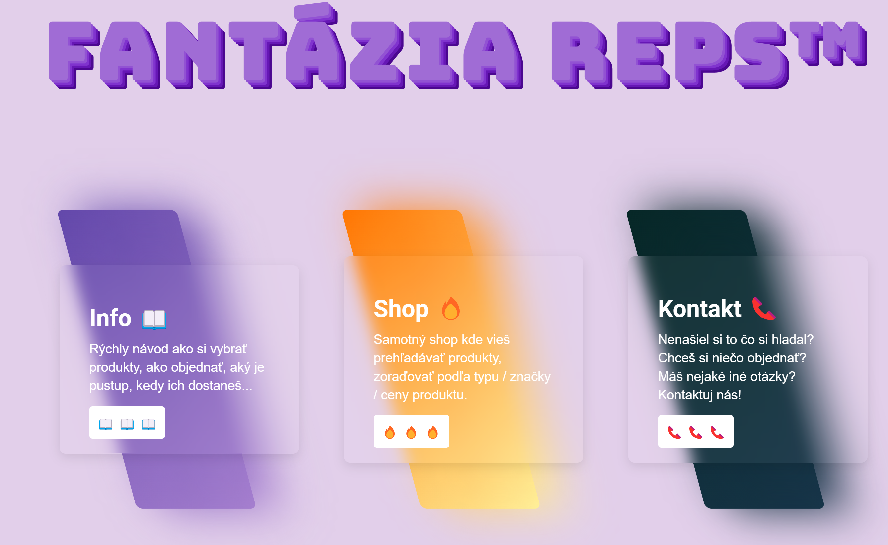

# Fantazia Reps
### 📝 Info
- This is my website which I use to resell products from **Pandabuy** (or other chinese sites).
- It it designed to be more of a **cataloge website** then a one used for directly re/selling products, therefore it will **not** have any sort of payment method implemented in the future.

### 🗣️ Language
- The whole website is currently only available in Slovak (SK).
- English (EN) comming soon.

### 🔥 Sneak Peak

#### Smooth Hover Animations
        |  
:---------------------------------------------------------------------------:|:----------------------------------------------------------------:
        |  

### 🖥️ Run it yourself!
> How do I start the website?
1. Make sure you have [NodeJS](https://nodejs.org/en) installed
2. Download all modules with `npm i`
3. After that you can start the website with `npm start`

